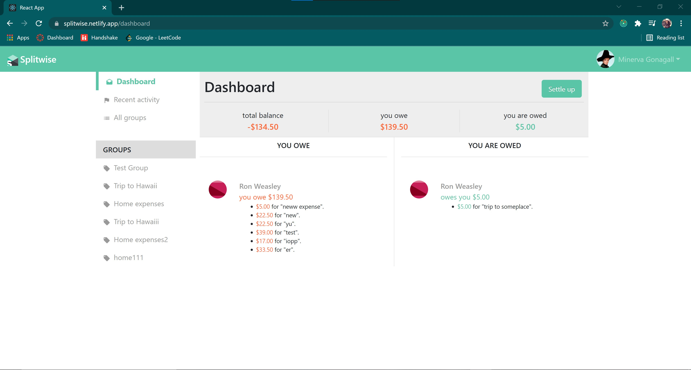

# Splitwise (CMPE-273 Lab2)

### Goal - To develop a prototype of Splitwise using Node.js, React.js, MongoDB, Redux, Passport, JWT Token, AWS EC2 and Apache Kafka.

### Deployment
#### Frontend : https://splitwise.netlify.app/
#### Backend : https://splitwise-backend-lab2.herokuapp.com

### Pages and Features
1. Landing Page 
2. Signup/Signin Page  
3. Dashboard 
4. Profile 
5. Create New Group 
6. Expense (Add comments) 
7. My Groups 
8. Group Details 
9. Recent Activity 
